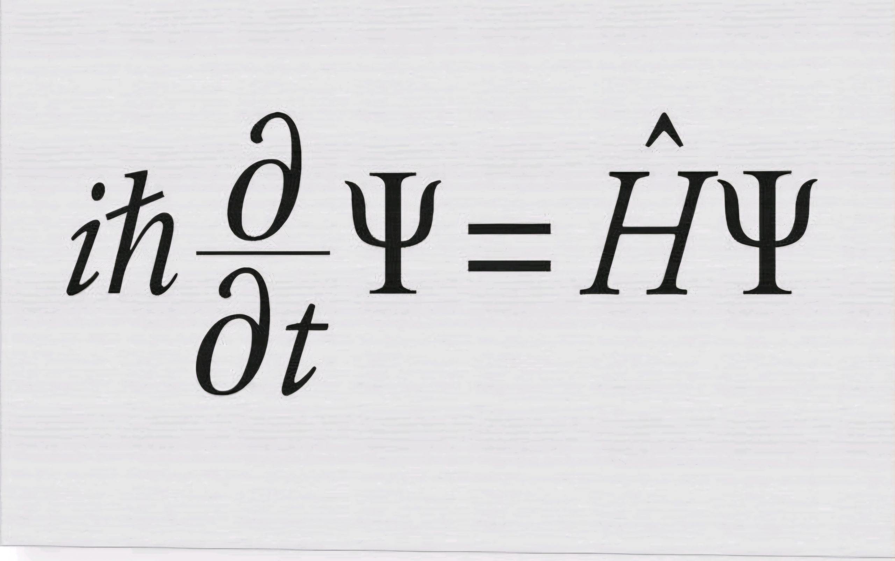

# pqm
A repository for Computational Quantum Physics course.

Schrodinger's Equation is a Sturm-Liouville Problem, where solving it provides the Energies of the system (eigenvalues), plus the wavefunction($\Psi$(x)). 

### In the following picture, the Schrodinger's Equation is presented:

Extra information for Scrodinger's Equation can be found <a href="https://en.wikipedia.org/wiki/Schr%C3%B6dinger_equation" 
           target="_blank">here</a>.

